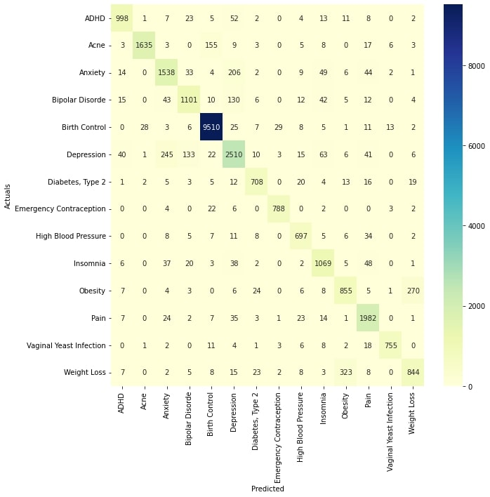

# Drug Category Classification

## Introduction

This projects aims to build two deep neural network models, namely CNN and Bi-LSTM, 
to classify drug categories from a set of online drug reviews using Tensorflow/Keras and [UCI Drug Review dataset](https://www.kaggle.com/datasets/jessicali9530/kuc-hackathon-winter-2018).

Our models are able to classify 14 different drug categories from drug reviews with an overall accuracy of approximately `89%`. 
An online version of this notebook is available on [Colab](https://colab.research.google.com/drive/1RtFzH5kxEX0fiyEbd2MLI9fimmovX4tE?usp=sharing).

## How to run?

* Require `python 3.8` or higher

* Install all dependencies for this project
```
$ pip install -r requirements.txt
``` 

* Start Jupyter Notebook
```
$ jupyter notebook
```

## Experiment results

* CNN model with a Word Embedding layer using GloVe achives an accuracy of `89.24%`

<p align="center">
  
</p>

* Bi-LSTM model with a Word Embedding layer using GloVe achives an accuracy of `88.91%`

<p align="center">
  
</p>
